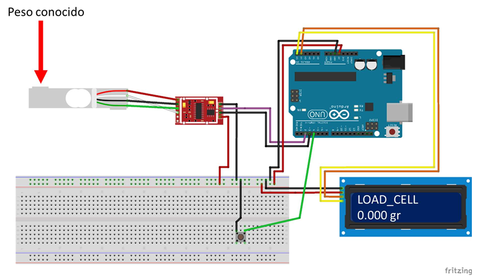

# 🚀 Banco de Pruebas para Motor Cohete

Aplicación para análisis de motores cohete de propulsante sólido. Permite grabar datos de empuje desde un Arduino con celda de carga, visualizar gráficos y calcular parámetros de rendimiento.

## 📋 Características
- Grabación en tiempo real desde Arduino
- Análisis de empuje, velocidad y altura
- Cálculo de impulso, Isp y apogeo
- Exportación de datos a CSV
- Interfaz gráfica intuitiva

## ⚙️ Hardware Requerido
- Arduino Uno
- Celda de carga NA4 500kg
- Amplificador HX711
- Botón para tarar (conectar entre pin 4 y GND)

## 🔌 Diagrama de Conexiones
HX711 ↔ Arduino:
DT → Pin 2
SCK → Pin 3
VCC → 5V
GND → GND

Celda de carga ↔ HX711:
Rojo → E+
Negro → E-
Blanco → A-
Verde → A+

## 🚀 Instalación y Uso

### Para el ejecutable (Windows):
1. Descarga `BancoPruebas.exe` desde [releases/latest](releases/)
2. Ejecuta el archivo .exe
3. Conecta el Arduino con el hardware instalado

### Para el código Python:

Solo descarga el archivo .exe y distruta

# Para desarrolladores que deseen hacer modificaciones al código entonce instalar dependencias:
pip install -r app/requirements.txt

# Ejecutar aplicación
python app/main.py

## Para el código Arduino:
Abre arduino/hx711_empuje.ino en Arduino IDE

Instala la librería HX711 (incluida en /arduino/HX711)

Sube el sketch al Arduino

📊 Funcionalidades de la Aplicación
Grabar datos: Captura en tiempo real desde Arduino

Cargar CSV: Analiza datos guardados previamente

Visualizar gráficos:

Curva de empuje
Velocidad teórica
Altura alcanzada

Resultados calculados:

Impulso total (N·s)
Isp (Impulso específico)
Apogeo estimado
Relación empuje/peso
Entre otros..

🧪 Calibración
Sigue la guía en docs/guia_calibración.md para calibrar la celda de carga.
