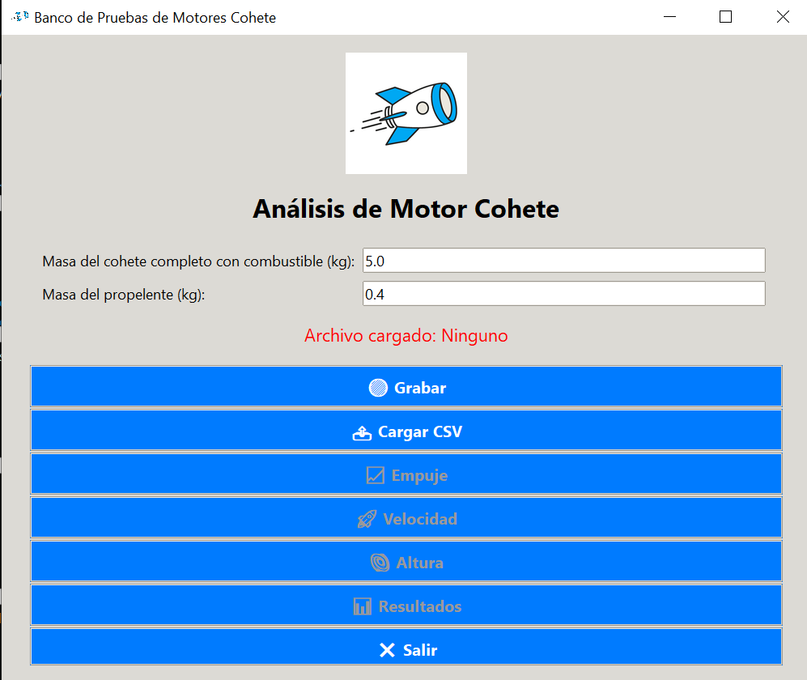
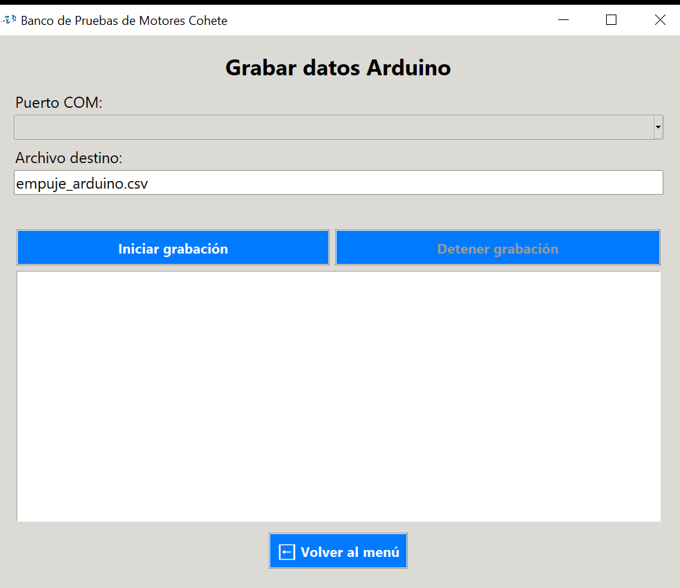
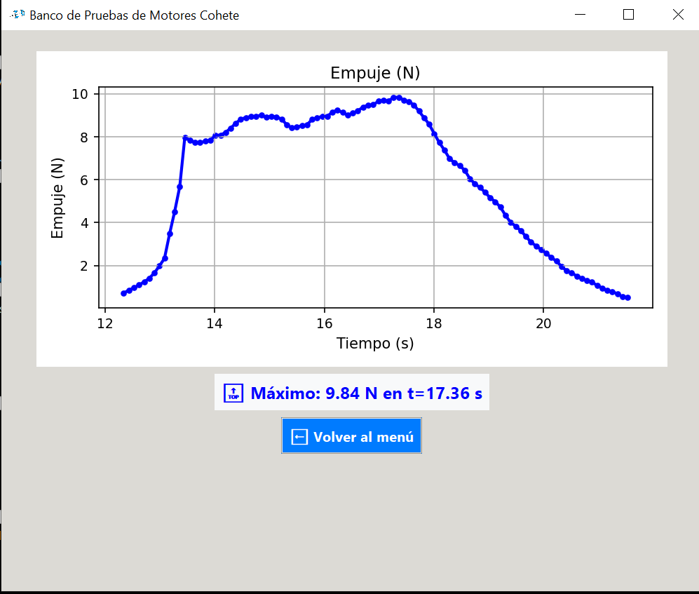
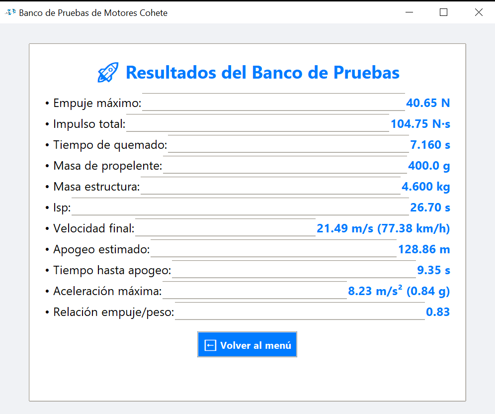

# 🚀 Banco de Pruebas para Motor Cohete

Aplicación para análisis de motores cohete de propulsante sólido. Permite grabar datos de empuje desde un Arduino con celda de carga, visualizar gráficos y calcular parámetros de rendimiento.

## 📋 Características
- Grabación en tiempo real desde Arduino
- Análisis de empuje, velocidad y altura
- Cálculo de impulso, Isp y apogeo
- Exportación de datos a CSV
- Interfaz gráfica intuitiva

## ⚙️ Hardware Requerido
- Arduino Uno
- Celda de carga NA4 500kg
- Amplificador HX711
- Botón para tarar (conectar entre pin 4 y GND) OPCIONAL

## 🔌 Diagrama de Conexiones
HX711 ↔ Arduino:
DT → Pin 2

SCK → Pin 3

VCC → 5V

GND → GND

Celda de carga ↔ HX711:

Rojo → E+

Negro → E-

Blanco → A-

Verde → A+

 Diagrama unicamente ilustrativo, rectificar y hacer conexiones mencionadas anteriormente

## 🚀 Instalación y Uso

### Para el ejecutable (Windows):
1. Descarga `BancoPruebas.exe` desde https://drive.google.com/file/d/1kL0Se85lEFvA84LTIoJhYkSnOoNcB8FL/view?usp=sharing
2. Ejecuta el archivo .exe
3. Conecta el Arduino con el hardware instalado y listo. :)

### Para el código Python:

Solo descarga el archivo .exe y distruta

# Para desarrolladores que deseen hacer modificaciones al código entonces instalar dependencias:
pip install -r app/requirements.txt

# Ejecutar aplicación
python app/ProgramaBancoPruebas.py

## Para el código Arduino:
Abre arduino/hx711_empuje.ino en Arduino IDE

Instala la librería HX711 incluida en el IDE de Arduino

Sube el sketch al Arduino

📊 Funcionalidades de la Aplicación
Grabar datos: Captura en tiempo real desde Arduino

Cargar CSV: Analiza datos guardados previamente

Visualizar gráficos:

Curva de empuje
Velocidad teórica
Altura alcanzada

Resultados calculados:

Impulso total (N·s)
Isp (Impulso específico)
Apogeo estimado
Relación empuje/peso
Entre otros..

## 🧪 Calibración

Debes modificar el factor de calibración en el codigo de arduino dependiendo tu peso conocido. 

